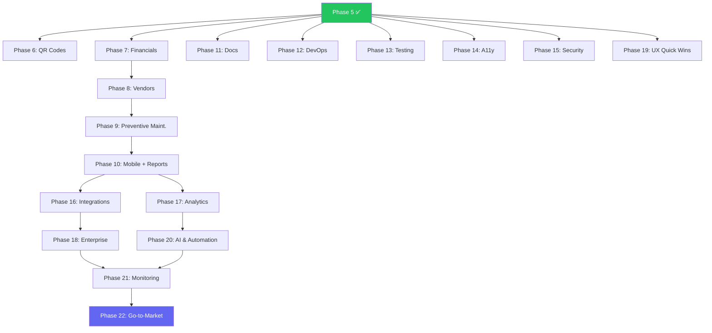

# AssetFlow — Complete Development Roadmap

> Enterprise Asset & Resource Management Platform  
> Last updated: August 30, 2026

---

## Table of Contents

- [Completed Phases](#-completed-phases)
- [Phase 6 — QR Code & Physical Tracking](#phase-6--qr-code--physical-tracking)
- [Phase 7 — Financial Module](#phase-7--financial-module)
- [Phase 8 — Vendor & Warranty Management](#phase-8--vendor--warranty-management)
- [Phase 9 — Preventive Maintenance & Scheduling](#phase-9--preventive-maintenance--scheduling)
- [Phase 10 — Mobile PWA & Advanced Reports](#phase-10--mobile-pwa--advanced-reports)
- [Phase 11 — Documentation](#phase-11--documentation)
- [Phase 12 — DevOps & Deployment](#phase-12--devops--deployment)
- [Phase 13 — Testing & Reliability](#phase-13--testing--reliability)
- [Phase 14 — Accessibility](#phase-14--accessibility-a11y)
- [Phase 15 — Advanced Security](#phase-15--advanced-security)
- [Phase 16 — Integrations](#phase-16--integrations)
- [Phase 17 — Analytics & Intelligence](#phase-17--analytics--intelligence)
- [Phase 18 — Enterprise Features](#phase-18--enterprise-features)
- [Phase 19 — UX Quick Wins](#phase-19--ux-quick-wins)
- [Phase 20 — AI & Automation](#phase-20--ai--automation)
- [Phase 21 — Monitoring & Observability](#phase-21--monitoring--observability)
- [Phase 22 — Go-to-Market](#phase-22--go-to-market)
- [Timeline](#-timeline)
- [Architecture Evolution](#-architecture-evolution)
- [Key Decision Points](#-key-decision-points)

---

## ✅ Completed Phases

| Phase | Focus | Key Deliverables | Tests |
|-------|-------|-----------------|-------|
| **Phase 1** | Core Foundation | Auth, RBAC (4 roles), Prisma schema, CRUD APIs, JWT auth, password policy | 80+ |
| **Phase 2** | Full Feature Build | Allocations, Bookings (conflict detection), Maintenance workflow, Audits, Reports, Activity log, Notifications, Org management | 180+ |
| **Phase 3** | Security Hardening | Input sanitization (XSS/SQLi), rate limiting, API gateway, audit logging, account lockout, password cooldown | 268 |
| **Phase 4** | UI/UX Beautification | 6 new components (Toast, Tooltip, Skeleton, EmptyState, StatCard, Breadcrumb), sidebar upgrade, animated KPIs, staggered animations, mobile hamburger menu | 268 |
| **Phase 4.5** | Quality Hardening | Replace alert()/confirm() → ConfirmDialog, N+1 fix, pagination, error boundaries, TypeScript interfaces, button loading states, sidebar persistence, favicon, SEO, focus refresh | 268 |
| **Phase 5** | Multi-Location & Custom Fields | Location hierarchy (7-level tree), LocationTreeSelect, location-scoped RBAC (`getLocationScope`), location-scoped dashboards/reports/audits/maintenance, asset location transfer, DynamicFieldRenderer, custom field export/search | 268 |

**Current stats**: 268 tests · 52+ API routes · 17 pages · 20+ UI components · 12 database models · 0 TypeScript errors

---

## Phase 6 — QR Code & Physical Tracking

> **Goal**: Scan any asset with a phone to see its full history  
> **Effort**: ~2 days  
> **Depends on**: Phase 5 ✅

| Task | Details |
|------|---------|
| QR code generation | Auto-generate QR code per asset (encode asset ID + URL) |
| QR display on asset detail | Show QR on asset detail page with download button (PNG/SVG) |
| Bulk label printing | Generate PDF sheet of QR labels (configurable grid: 2x4, 3x8, etc.) |
| Mobile scan page | Camera-based QR scanner → redirect to asset detail |
| Barcode support | Optional Code128 barcode for warehouse/handheld scanners |
| Asset photo upload | Upload/capture photo during registration, display in detail page |
| Quick check-in/out | Scan QR → one-tap assign/return asset |

**Recommended packages**: `qrcode` (generation), `html5-qrcode` (scanner), `@react-pdf/renderer` (bulk labels)

---

## Phase 7 — Financial Module

> **Goal**: Track asset value, depreciation, and purchase cost for accounting  
> **Effort**: ~2-3 days  
> **Depends on**: Phase 5 ✅

| Task | Details |
|------|---------|
| Purchase tracking | Purchase price, date, PO number, invoice number, supplier |
| Depreciation engine | Straight-line, Declining balance, Sum-of-years-digits methods |
| Book value calculation | Auto-calculate current book value based on method + age |
| Salvage value | Expected residual value at end of life |
| Asset valuation dashboard | Total value by location, category, department with charts |
| Insurance tracking | Policy number, provider, coverage amount, premium, renewal date |
| Insurance renewal alerts | Notification 30 days before policy expiry |
| Financial reports | Total acquisition cost, current value, depreciation schedule, tax report |
| Currency support | Configurable currency symbol (₹, $, €, £) |

---

## Phase 8 — Vendor & Warranty Management

> **Goal**: Know who sold what, when warranties expire, and which vendors perform best  
> **Effort**: ~2 days  
> **Depends on**: Phase 7

| Task | Details |
|------|---------|
| Vendor directory | CRUD: name, company, email, phone, address, category, GST/tax ID |
| Link vendors to assets | "Purchased from" and "Serviced by" relationships |
| Warranty tracking | Start date, end date, terms, coverage type per asset |
| Warranty alerts | Notification when warranty expires in 30/15/7 days |
| Warranty claims | Submit claim → track status → resolved |
| AMC (Annual Maintenance Contract) | Contract details, cost, renewal cycle, auto-renewal flag |
| AMC renewal alerts | Notification before AMC expiry |
| Vendor performance dashboard | Average repair time, total cost, number of services per vendor |

---

## Phase 9 — Preventive Maintenance & Scheduling

> **Goal**: Stop waiting for things to break — schedule maintenance proactively  
> **Effort**: ~2-3 days  
> **Depends on**: Phase 8

| Task | Details |
|------|---------|
| Maintenance schedules | Define recurring schedule per asset: daily, weekly, monthly, quarterly, yearly |
| Auto-create requests | System auto-generates maintenance requests based on schedule |
| Maintenance calendar | Full calendar view (monthly/weekly) of all scheduled maintenance |
| Compliance tracking | Track if scheduled maintenance was completed on time |
| Overdue maintenance alerts | Notification when scheduled maintenance is missed |
| Maintenance cost tracking | Log cost per maintenance event (parts + labor) |
| Cost analysis reports | Total maintenance cost by asset, category, location, vendor |
| Maintenance history timeline | Visual timeline of all maintenance events for an asset |

---

## Phase 10 — Mobile PWA & Advanced Reports

> **Goal**: Field workers use phones, managers need PDF reports  
> **Effort**: ~3-4 days  
> **Depends on**: Phase 9

### Mobile PWA

| Task | Details |
|------|---------|
| PWA manifest | `manifest.json` with app name, icons, theme color, splash screen |
| Service worker | Cache static assets for offline access |
| Install prompt | "Add to Home Screen" banner |
| Mobile-optimized layouts | Responsive tables → card layouts on mobile |
| Mobile audit mode | Walk through location, scan QR, mark asset status from phone |
| Push notifications | Web push notifications for critical alerts (overdue, warranty expiry) |

### Advanced Reports

| Task | Details |
|------|---------|
| Report builder | Filter by date range, location, category, department, status, vendor |
| PDF generation | Branded, printable PDF reports with company logo |
| CSV/Excel export | Download filtered data as spreadsheet |
| Scheduled reports | Auto-email weekly/monthly summary to configured recipients |
| Asset lifecycle report | Visual journey: Purchased → Allocated → Maintained → Retired |
| Cost center report | Total cost (purchase + maintenance) grouped by location/department |
| Compliance report | Audit completion rates, overdue maintenance, expired warranties |

---

## Phase 11 — Documentation

> **Goal**: Make the project understandable and maintainable  
> **Effort**: ~1-2 days  
> **Can run in parallel with any phase**

| Task | Details |
|------|---------|
| README.md | Project overview, screenshots, tech stack, setup instructions, architecture diagram |
| API documentation | All 52+ endpoints documented with request/response examples (Swagger or markdown) |
| Database schema docs | ER diagram, model descriptions, relationship explanations |
| Deployment guide | Step-by-step for Vercel, Railway, Docker, VPS deployment |
| User manual | End-user guide with screenshots for each feature |
| Developer onboarding | "How to contribute" guide — code style, PR process, testing conventions |
| Environment variables | Document every `.env` variable with description, defaults, and examples |
| Changelog | Maintain `CHANGELOG.md` with version history |

---

## Phase 12 — DevOps & Deployment

> **Goal**: One-click deploy, automated pipelines, production readiness  
> **Effort**: ~2 days  
> **Can run in parallel with Phase 6-10**

| Task | Details |
|------|---------|
| Dockerfile | Multi-stage build (builder → runner) for containerized deployment |
| docker-compose.yml | App + PostgreSQL + optional Redis for dev/staging |
| GitHub Actions CI | Auto-run tests + lint + type-check on every PR |
| GitHub Actions CD | Auto-deploy to staging on merge to `develop`, production on merge to `main` |
| Database migrations | Switch from `prisma db push` to `prisma migrate` for production safety |
| Environment management | Separate configs for development, staging, production |
| Health check endpoint | `/api/health` with DB connectivity check (already exists, enhance) |
| Backup strategy | Automated daily PostgreSQL backups to cloud storage |
| SSL/HTTPS | Enforce HTTPS in production |
| Domain setup | Custom domain with DNS configuration guide |

---

## Phase 13 — Testing & Reliability

> **Goal**: Confidence that nothing breaks when you ship  
> **Effort**: ~2-3 days  
> **Can run in parallel with Phase 6-10**

| Task | Details |
|------|---------|
| Integration tests | Test actual API routes with test database (Prisma + Vitest) |
| E2E tests | Playwright tests for critical flows: login → create asset → allocate → return → audit |
| Load testing | K6 or Artillery: verify app handles 50+ concurrent users |
| API contract tests | Validate request/response schemas match TypeScript types |
| Test database seeding | Separate seed script for test environment |
| Code coverage | Target 80%+ coverage, enforce in CI |
| Snapshot tests | UI component snapshot tests for regression detection |
| Error scenario tests | Test timeout, network failure, invalid data, permission denied |

---

## Phase 14 — Accessibility (a11y)

> **Goal**: Usable by everyone, including people with disabilities  
> **Effort**: ~1-2 days  
> **Can run in parallel with any phase**

| Task | Details |
|------|---------|
| Keyboard navigation | Tab through all interactive elements in logical order |
| Focus indicators | Visible focus ring on all buttons, inputs, links |
| ARIA labels | Label all icon-only buttons, status badges, modals |
| Screen reader support | Announce dynamic content changes (toast notifications, table updates) |
| Color contrast | WCAG AA compliance (4.5:1 ratio for text, 3:1 for UI) |
| Reduced motion | Respect `prefers-reduced-motion` — disable animations for users who need it |
| Form error association | Link error messages to input fields with `aria-describedby` |
| Skip navigation | "Skip to main content" link for keyboard users |
| Alt text | Descriptive alt text on all images and icons |
| Accessibility audit | Run axe-core or Lighthouse a11y audit, fix all critical issues |

---

## Phase 15 — Advanced Security

> **Goal**: Production-grade security beyond Phase 3 hardening  
> **Effort**: ~2 days  
> **Should complete before go-to-market**

| Task | Details |
|------|---------|
| Two-Factor Authentication (2FA) | TOTP via Google Authenticator / Authy |
| CSRF protection | Anti-CSRF tokens on all state-changing forms |
| Content Security Policy (CSP) | Strict CSP headers to prevent XSS |
| JWT refresh tokens | Short-lived access tokens + long-lived refresh tokens |
| Force logout all devices | Admin can force-logout a user from all sessions |
| Session management dashboard | User can see active sessions + revoke them |
| Password history | Prevent reusing last 5 passwords |
| IP allowlisting | Optional: restrict admin access to specific IPs |
| Data encryption at rest | Encrypt sensitive fields (email, phone) in database |
| Security headers | X-Frame-Options, X-Content-Type-Options, Referrer-Policy, Permissions-Policy |
| Dependency audit | `npm audit` in CI, auto-PR for vulnerable dependencies |
| Penetration testing | Manual or automated security scan (OWASP ZAP) |

---

## Phase 16 — Integrations

> **Goal**: Connect AssetFlow with the tools your company already uses  
> **Effort**: ~3-4 days  
> **Depends on**: Phase 10

### HR System Integration

| Task | Details |
|------|---------|
| Employee sync API | Import/sync employees from external HR systems |
| Google Workspace connector | Pull user directory from Google Workspace |
| BambooHR connector | Sync employees, departments, locations from BambooHR |
| Zoho People connector | Import employee data from Zoho People |
| Auto-provisioning | Automatically create/deactivate employees when synced |
| Sync schedule | Configurable sync frequency: manual, daily, or real-time webhook |

### Accounting Integration

| Task | Details |
|------|---------|
| Tally export | Push depreciation entries and purchase data to Tally |
| Zoho Books connector | Sync asset purchases, depreciation schedules to Zoho Books |
| QuickBooks integration | Export financial data to QuickBooks Online |
| Xero integration | Push journal entries for asset depreciation to Xero |
| Configurable chart of accounts | Map asset categories to GL account codes |

### Communication Integration

| Task | Details |
|------|---------|
| Slack Bot | Request assets, get notifications, approve maintenance from Slack |
| Microsoft Teams Bot | Same capabilities as Slack bot for Teams users |
| Email digest | Configurable daily/weekly email summary of pending actions |
| SMS alerts | Optional SMS for critical alerts (asset theft, warranty expiry) via Twilio |

### Webhook System

| Task | Details |
|------|---------|
| Webhook management UI | Create, edit, delete webhooks with URL + secret |
| Event types | asset.created, asset.transferred, maintenance.raised, audit.completed, warranty.expiring |
| Webhook delivery | Retry with exponential backoff (3 attempts) |
| Webhook logs | View delivery history, status codes, response times |
| Webhook testing | "Send test event" button for each webhook |

---

## Phase 17 — Analytics & Intelligence

> **Goal**: Turn raw data into actionable business insights  
> **Effort**: ~3-4 days  
> **Depends on**: Phase 10

### Custom Dashboard Builder

| Task | Details |
|------|---------|
| Widget library | KPI cards, bar charts, pie charts, line charts, tables, heatmaps |
| Drag-and-drop layout | Resize and reposition widgets on a grid |
| Dashboard templates | Pre-built dashboards: Executive, Operations, Finance, Maintenance |
| Save & share dashboards | Multiple saved dashboards per user, shareable via URL |
| Dashboard filters | Global date range, location, department filters applied across all widgets |
| Auto-refresh | Configurable refresh interval (30s, 1m, 5m, manual) |

### Trend Analysis

| Task | Details |
|------|---------|
| Month-over-month comparisons | Asset growth rate, maintenance trend, utilization changes |
| Year-over-year reports | Annual comparison for budgeting and planning |
| Sparkline charts | Inline trend indicators on KPI cards |
| Forecasting | Simple linear projection: "At this rate, you'll have 500 assets by March" |

### TCO (Total Cost of Ownership)

| Task | Details |
|------|---------|
| TCO calculator | Purchase + maintenance + insurance + depreciation = true cost per asset |
| TCO by category | Which asset type costs the most to own over its lifetime? |
| TCO by location | Which location has the highest total ownership cost? |
| Break-even analysis | "This laptop costs ₹60K but generates ₹8K/month in value — breaks even in 7.5 months" |
| Replacement recommendations | Flag assets where maintenance cost exceeds replacement cost |

---

## Phase 18 — Enterprise Features

> **Goal**: Make AssetFlow ready for large organizations with complex workflows  
> **Effort**: ~4-5 days  
> **Depends on**: Phase 16

### Approval Workflows

| Task | Details |
|------|---------|
| Workflow builder | Define multi-level approval chains per action type |
| Configurable rules | "Asset purchases over ₹50K need CTO approval", "Location transfers need regional manager sign-off" |
| Approval queue | Dashboard showing all pending approvals with one-click approve/reject |
| Escalation | Auto-escalate to next level if not approved within X hours |
| Approval history | Full audit trail of who approved what and when |

### Bulk Operations

| Task | Details |
|------|---------|
| Multi-select | Checkbox selection on asset/allocation/maintenance tables |
| Bulk transfer location | Select 50 assets → move all to a new location in one click |
| Bulk status change | Change status of multiple assets (e.g., retire 20 old laptops) |
| Bulk export | Export only selected assets to CSV/PDF |
| Bulk label print | Print QR labels for selected assets only |
| Bulk delete | Delete multiple draft/test records with confirmation |

### Asset Leasing Module

| Task | Details |
|------|---------|
| Lease tracking | Lease terms, monthly payment, start/end date, buyout option |
| Lease vs. own analysis | Compare TCO of leasing vs. purchasing |
| Lease renewal alerts | 60/30/15 day notifications before lease expiry |
| Lease payment schedule | Track monthly payments with paid/unpaid status |
| Buyout workflow | Convert leased asset to owned asset at end of term |

### Compliance & Regulatory

| Task | Details |
|------|---------|
| ISO 27001 asset register | Pre-formatted report for ISO 27001 Information Asset Register |
| SOC 2 evidence | Auto-generate evidence of access controls, change logs, audit trails |
| GDPR data mapping | Identify assets that contain/process personal data |
| Compliance dashboard | Overview of compliance status across all standards |
| Custom compliance checks | Define org-specific rules: "All servers must have encryption enabled" |

---

## Phase 19 — UX Quick Wins

> **Goal**: Small features that make the daily experience significantly better  
> **Effort**: ~2-3 days  
> **Can run in parallel with Phase 16-18**

| Task | Details | Effort |
|------|---------|--------|
| Dark/Light mode toggle | Theme switcher in sidebar — currently dark-only | 2 hr |
| Keyboard shortcuts | `/` for search, `Ctrl+K` command palette, `N` for new asset | 3 hr |
| Recently viewed assets | Sidebar widget showing last 10 viewed assets | 1 hr |
| Asset comparison | Side-by-side compare 2 assets (specs, cost, maintenance history) | 2 hr |
| Import from CSV | Bulk-upload assets from spreadsheet with column mapping wizard | 4 hr |
| Favorites / Pinned assets | Star frequently accessed assets for quick access | 1 hr |
| Global search (Ctrl+K) | Search across assets, employees, locations, maintenance requests from one input | 3 hr |
| Table column customization | Show/hide and reorder table columns per page | 2 hr |
| Inline editing | Click-to-edit asset fields directly in the table without opening detail page | 3 hr |
| User preferences page | Configure notification preferences, default location, date format, timezone | 2 hr |

---

## Phase 20 — AI & Automation

> **Goal**: Let the system learn from data and make intelligent decisions  
> **Effort**: ~4-5 days  
> **Depends on**: Phase 17

### Predictive Maintenance

| Task | Details |
|------|---------|
| MTBF analysis | Calculate Mean Time Between Failures per asset/category based on historical maintenance data |
| Failure prediction | Predict when an asset will likely need maintenance next (rule-based + statistical) |
| Risk scoring | Assign risk scores (low/medium/high/critical) to assets based on age, maintenance history, condition |
| Proactive alerts | "This printer has a 78% chance of failure in the next 30 days based on 2-year maintenance history" |
| Maintenance budget forecasting | Predict next quarter's maintenance costs based on trends |

### Smart Allocation

| Task | Details |
|------|---------|
| Optimal asset suggestion | When someone requests a laptop, suggest the best one based on: location proximity, condition, utilization history, age |
| Demand forecasting | "Marketing department will likely need 5 more laptops next quarter based on hiring trends" |
| Underutilized asset detection | Flag assets that haven't been used in 90+ days — suggest reallocation or retirement |
| Auto-assignment rules | "All new hires in Engineering get a MacBook Pro + monitor + keyboard automatically" |

### Natural Language Search

| Task | Details |
|------|---------|
| NL query parser | "Show me all laptops in Mumbai that were serviced last month" → auto-generate filters |
| AI-powered search | Semantic search that understands intent, not just keywords |
| Query suggestions | Auto-complete with smart suggestions based on data patterns |
| Saved searches | Save frequently used NL queries as one-click shortcuts |

### Anomaly Detection

| Task | Details |
|------|---------|
| Unusual patterns | Flag: asset allocated to 5 people in one week, maintenance cost 3x average |
| Theft/loss detection | Alert when asset hasn't been scanned in expected location for X days |
| Cost anomalies | Flag purchase orders or maintenance costs that deviate significantly from historical norms |
| Automated reports | Weekly anomaly digest sent to admins highlighting suspicious patterns |

---

## Phase 21 — Monitoring & Observability

> **Goal**: Know when something breaks before users report it  
> **Effort**: ~1-2 days  
> **Should complete before go-to-market**

| Task | Details |
|------|---------|
| Error tracking | Sentry integration for real-time crash reports with stack traces |
| Performance monitoring | Track API response times, slow queries, memory usage |
| Uptime monitoring | External health check every 5 minutes, alert on downtime |
| Usage analytics | Track feature usage: which pages visited, which actions performed |
| User activity heatmap | Most active hours, busiest locations |
| API usage dashboard | Request count by endpoint, error rates, p95 latency |
| Database monitoring | Connection pool usage, slow query log, table size growth |
| Alerting | Slack/email alerts for: errors spike, API down, DB connection lost |
| Log aggregation | Centralized logging (structured JSON) for debugging production issues |

---

## Phase 22 — Go-to-Market

> **Goal**: Turn the product into a business  
> **Effort**: ~3-5 days  
> **Depends on**: Phases 6-20 mostly complete

| Task | Details |
|------|---------|
| Landing page | Marketing website explaining the product, features, screenshots |
| Pricing tiers | Free (1 location, 50 assets) → Pro (unlimited) → Enterprise (custom) |
| Demo mode | One-click demo with pre-loaded data for prospects |
| Onboarding wizard | First-time setup: create org → add locations → define categories → invite team |
| Multi-tenancy | Single deployment serves multiple customers with data isolation |
| Billing integration | Stripe/Razorpay subscription management |
| Customer support | Help center, knowledge base, in-app chat widget |
| White-labeling | Custom logo, colors, domain per tenant |
| Multi-language (i18n) | UI language switcher (English, Hindi, Spanish, etc.) |
| Legal | Terms of service, privacy policy, data processing agreement |
| App store listings | PWA listing on Microsoft Store, Google Play (TWA) |

---

## 📊 Timeline

```
                       ┌─ COMPLETED ────────────────────────────────────────┐
Phase 1-5              ████████████████████████████████████████████████████   ✅ Done
                       └────────────────────────────────────────────────────┘

                       ┌─ CORE FEATURES ────────────────────────────────────┐
Phase 6  (QR Codes)    ████████████░░░░░░░░░░░░░░░░░░░░░░░░░░░░░░░░░░░░░░   ~2 days
Phase 7  (Financials)  ████████████████░░░░░░░░░░░░░░░░░░░░░░░░░░░░░░░░░░   ~2-3 days
Phase 8  (Vendors)     ████████████░░░░░░░░░░░░░░░░░░░░░░░░░░░░░░░░░░░░░░   ~2 days
Phase 9  (Preventive)  ████████████████░░░░░░░░░░░░░░░░░░░░░░░░░░░░░░░░░░   ~2-3 days
Phase 10 (Mobile+Rpt)  ████████████████████████░░░░░░░░░░░░░░░░░░░░░░░░░░   ~3-4 days
                       └────────────────────────────────────────────────────┘

                       ┌─ QUALITY TRACKS (parallel) ────────────────────────┐
Phase 11 (Docs)        ████████░░░░░░░░░░░░░░░░░░░░░░░░░░░░░░░░░░░░░░░░░░   ~1-2 days
Phase 12 (DevOps)      ████████████░░░░░░░░░░░░░░░░░░░░░░░░░░░░░░░░░░░░░░   ~2 days
Phase 13 (Testing)     ████████████████░░░░░░░░░░░░░░░░░░░░░░░░░░░░░░░░░░   ~2-3 days
Phase 14 (A11y)        ████████░░░░░░░░░░░░░░░░░░░░░░░░░░░░░░░░░░░░░░░░░░   ~1-2 days
Phase 15 (Security)    ████████████░░░░░░░░░░░░░░░░░░░░░░░░░░░░░░░░░░░░░░   ~2 days
                       └────────────────────────────────────────────────────┘

                       ┌─ PLATFORM EXPANSION ───────────────────────────────┐
Phase 16 (Integrations)████████████████████████░░░░░░░░░░░░░░░░░░░░░░░░░░   ~3-4 days
Phase 17 (Analytics)   ████████████████████████░░░░░░░░░░░░░░░░░░░░░░░░░░   ~3-4 days
Phase 18 (Enterprise)  ██████████████████████████████░░░░░░░░░░░░░░░░░░░░   ~4-5 days
Phase 19 (UX Wins)     ████████████████░░░░░░░░░░░░░░░░░░░░░░░░░░░░░░░░░░   ~2-3 days  ← parallel
Phase 20 (AI & Auto)   ██████████████████████████████░░░░░░░░░░░░░░░░░░░░   ~4-5 days
                       └────────────────────────────────────────────────────┘

                       ┌─ LAUNCH ───────────────────────────────────────────┐
Phase 21 (Monitoring)  ████████░░░░░░░░░░░░░░░░░░░░░░░░░░░░░░░░░░░░░░░░░░   ~1-2 days
Phase 22 (Go-to-Market)██████████████████████████████░░░░░░░░░░░░░░░░░░░░   ~3-5 days
                       └────────────────────────────────────────────────────┘

                       ─────────────────────────────────────────────────────
                       Total estimated effort: ~50-65 days
```

---

## 🏗 Architecture Evolution

```
TODAY (Phase 1-5)                           TARGET (Phase 22)
─────────────────────                       ──────────────────────────────────
✅ Multi-location hierarchy             →    Multi-tenant, multi-location
✅ Dynamic custom fields per category   →    Visual form builder UI
✅ Location-scoped RBAC                 →    Custom approval workflows
✅ CSV export with custom fields        →    PDF + scheduled + branded reports
Manual asset lookup                    →    QR scan → instant details
No financial tracking                  →    Full depreciation + valuation + TCO
No vendor management                   →    Vendor directory + AMC + warranties
Reactive maintenance only              →    Preventive scheduling + AI prediction
Desktop responsive                     →    PWA mobile app + offline mode
No documentation                       →    Full API docs + user manual
Manual deployment                      →    CI/CD + Docker + auto-deploy
Unit tests only (268)                  →    Unit + Integration + E2E + Load
No accessibility audit                 →    WCAG AA compliant
Basic JWT auth                         →    2FA + refresh tokens + CSP
No monitoring                          →    Sentry + uptime + alerting
No integrations                        →    HR + Accounting + Slack/Teams + Webhooks
Basic reports only                     →    Custom dashboards + trend analysis + AI
No bulk operations                     →    Multi-select + bulk actions + CSV import
No AI/automation                       →    Predictive maintenance + NL search + anomaly detection
Single deployment                      →    SaaS product with billing + white-label
English only                           →    Multi-language (i18n)
Dark mode only                         →    Dark/Light theme toggle
```

---

## 🔑 Key Decision Points

### Before Phase 6
- **QR format**: Simple URL or include metadata (asset tag, location) in the QR payload?
- **Photo storage**: Local filesystem, Cloudinary, AWS S3, or Supabase Storage?

### Before Phase 7
- **Currency**: Single currency (₹) or multi-currency with exchange rates?
- **Depreciation**: Which methods are mandatory? Straight-line only or all three?
- **Tax compliance**: Indian IT Act depreciation schedules or international standards?

### Before Phase 10
- **Mobile strategy**: PWA (faster, cheaper) or React Native (richer, harder)?
- **Offline scope**: View-only offline, or allow creating records offline and syncing?

### Before Phase 15
- **2FA enforcement**: Optional for all users, or mandatory for admins?
- **Session duration**: How long before auto-logout? 24h? 7 days?

### Before Phase 16
- **Integration priority**: Which systems does your target customer already use?
- **Webhook format**: REST callbacks or also support GraphQL subscriptions?

### Before Phase 17
- **Analytics engine**: Build custom or integrate with Metabase/Grafana?
- **Real-time dashboards**: WebSocket live updates or periodic polling?

### Before Phase 20
- **AI approach**: Rule-based heuristics (simpler) or ML models (requires training data)?
- **NL search**: OpenAI API, self-hosted LLM, or keyword-based NLP?

### Before Phase 22
- **Hosting**: Self-hosted (customer's server) or SaaS (your server)?
- **Pricing model**: Per-user, per-asset, per-location, or flat tier?
- **Target market**: India-first or global from day one?

---

## 📎 Quick Reference

| Metric | Current (Phase 5) | Target (Phase 22) |
|--------|-------------------|-------------------|
| API Routes | 52+ | ~120+ |
| Pages | 17 | ~35+ |
| UI Components | 20+ | ~40+ |
| Test Count | 268 | 600+ |
| Test Types | Unit only | Unit + Integration + E2E + Load |
| Database Models | 12 | ~25+ |
| Supported Industries | Any (basic) | Any (fully configurable) |
| Deployment | Manual | CI/CD + Docker |
| Mobile Support | Responsive | PWA + offline |
| Languages | English | Multi-language |
| Auth | JWT | JWT + 2FA + refresh tokens |
| Integrations | None | HR + Accounting + Slack + Webhooks |
| AI Features | None | Predictive + NL Search + Anomaly |
| Dashboards | Fixed | Custom drag-and-drop builder |

---

## 📌 Phase Dependency Graph


