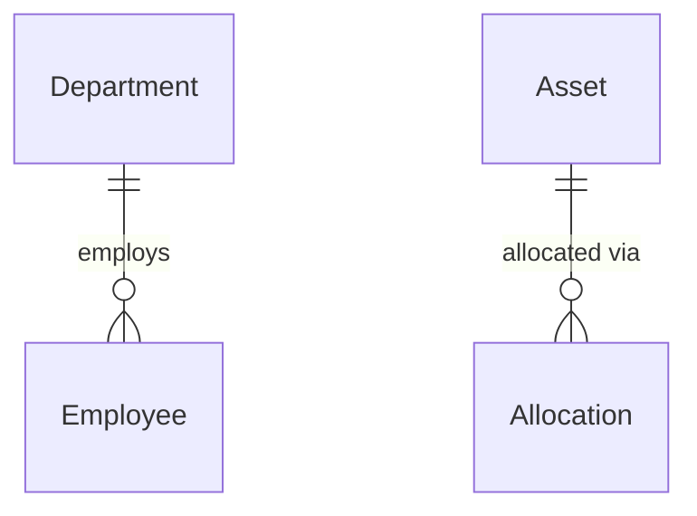

# Phase 2 — Code Guide (Beginner-Friendly)

This document explains the new code and concepts introduced in Phase 2 of AssetFlow.

---

## New Technologies Introduced

### Nodemailer

| Property | Detail |
|----------|--------|
| **What is it?** | A Node.js library for sending emails |
| **Main purpose** | Send transactional emails (notifications, password resets, alerts) |
| **Protocol** | SMTP (Simple Mail Transfer Protocol) — the standard way computers send email |
| **Analogy** | Like the postal service for emails — you give it a letter (message) and an address (recipient), and it delivers it |

```typescript
import nodemailer from 'nodemailer';

// 1. Create a "transport" — the connection to your email server
const transporter = nodemailer.createTransport({
  host: 'smtp.gmail.com',
  port: 587,
  auth: {
    user: 'your-email@gmail.com',
    pass: 'your-app-password',
  },
});

// 2. Send an email
await transporter.sendMail({
  from: 'AssetFlow <noreply@example.com>',
  to: 'recipient@example.com',
  subject: 'Asset Assigned',
  html: '<p>A laptop has been assigned to you.</p>',
});
```

#### What Is SMTP?
SMTP is the protocol (set of rules) that email servers use to send messages. When you configure SMTP in AssetFlow, you're telling it how to connect to your email provider (Gmail, SendGrid, etc.) to send notifications.

#### Gmail App Passwords
If you're using Gmail, you can't use your regular password. You need to generate an "App Password":
1. Go to [Google Account → Security](https://myaccount.google.com/security)
2. Enable 2-Factor Authentication
3. Go to App Passwords → Generate one for "Mail"
4. Use that 16-character password as `SMTP_PASSWORD`

---

## New Files Explained

### 1. `src/lib/notifier.ts` — The Notification Engine

**Language**: TypeScript  
**What it does**: Sends notifications to users through two channels (in-app and email).

#### Key Concepts

**Fire-and-forget pattern**:
```typescript
// The email is sent in the background — we don't wait for it
sendEmail(recipient.email, subject, message).catch(() => {});
// The .catch(() => {}) silently ignores any errors
// This prevents a failed email from breaking the main request
```

**Why fire-and-forget?** When a user allocates an asset, the response should be instant. If the email server is slow (or down), the user shouldn't have to wait. The notification email is a "nice to have," not a requirement.

**Graceful degradation**:
```typescript
if (isEmailConfigured) {
  transporter = nodemailer.createTransport({ ... });
} else {
  logger.info('SMTP not configured — email notifications disabled');
}
```
If SMTP is not configured, the system still works — it just uses in-app notifications only.

**HTML email template**:
The `wrapEmailTemplate()` function creates a clean, branded email:
```html
<div style="max-width: 560px; margin: auto; background: #fff; border-radius: 12px; padding: 32px;">
  <div>AF</div>  <!-- Logo -->
  <h2>Asset Assigned</h2>
  <p>Laptop XYZ has been assigned to you.</p>
</div>
```

---

### 2. `src/lib/pagination.ts` — The Pagination Toolkit

**Language**: TypeScript  
**What it does**: Provides reusable functions for consistent API pagination.

#### Key Concept: Offset-Based Pagination

When you have 1,000 assets and show 20 per page, you need to calculate which 20 to show:

```
Page 1: items 0-19    (skip 0, take 20)
Page 2: items 20-39   (skip 20, take 20)
Page 3: items 40-59   (skip 40, take 20)
```

The formula: `skip = (page - 1) × limit`

```typescript
// parsePagination does this math for you:
const { page, limit, skip } = parsePagination(request);
// page=3, limit=20 → skip=40

// Use in Prisma:
const assets = await prisma.asset.findMany({
  skip,       // Skip the first 40
  take: limit, // Take 20
});
```

#### Key Concept: Search with Case-Insensitive Contains

```typescript
// parseSearchFilter('laptop', ['name', 'assetTag'])
// Generates:
{
  OR: [
    { name: { contains: 'laptop', mode: 'insensitive' } },
    { assetTag: { contains: 'laptop', mode: 'insensitive' } },
  ]
}
// This means: find any record where name OR assetTag contains "laptop"
// 'insensitive' means: "Laptop", "LAPTOP", "laptop" all match
```

#### Key Concept: Preventing Abuse with Max Limit

```typescript
const MAX_LIMIT = 100;
const limit = Math.min(rawLimit, MAX_LIMIT);
// Even if someone sends ?limit=999999, they only get 100 results
```

---

### 3. `tests/unit/logger.test.ts` — Logger Tests

**Language**: TypeScript (Vitest)  
**What it does**: Tests the structured logger.

#### Key Testing Concepts

**Spying on console methods**:
```typescript
const consoleSpy = vi.spyOn(console, 'log').mockImplementation(() => {});
// This "intercepts" console.log calls so we can check what was logged
// mockImplementation(() => {}) prevents actual console output during tests

logger.info('Test message');
// Now check what was logged:
expect(consoleSpy.mock.calls[0][0]).toContain('Test message');
```

**Cleaning up spies**:
```typescript
afterEach(() => {
  vi.restoreAllMocks();
  // This resets ALL spies between tests
  // Without this, spy call counts leak between describe blocks
});
```

**Testing redaction**:
```typescript
logger.info('Login', { password: 'secret123' });
const output = consoleSpy.mock.calls[0][0];
expect(output).toContain('[REDACTED]');     // Password was replaced
expect(output).not.toContain('secret123');  // Actual password is hidden
```

---

### 4. `tests/unit/pagination.test.ts` — Pagination Tests

**Language**: TypeScript (Vitest)  
**What it does**: Tests the pagination utility functions.

#### Key Pattern: Mock Requests

```typescript
// Since parsePagination() needs a Request object, we create fake ones:
function mockRequest(url: string): Request {
  return new Request(url);
}

const result = parsePagination(mockRequest('http://localhost/api/assets?page=3&limit=10'));
expect(result.page).toBe(3);
expect(result.skip).toBe(20);
```

---

### 5. `README.md` — GitHub Documentation

**Format**: Markdown  
**What it does**: The first thing visitors see on your GitHub repository.

#### Key Elements
- **Badges**: CI status badges from GitHub Actions
- **Feature list**: Organized by domain (assets, bookings, maintenance, etc.)
- **Tech stack table**: Every technology used and why
- **Getting started**: Step-by-step setup instructions
- **API reference**: Every endpoint documented with method, path, and description
- **Mermaid diagram**: Database schema rendered as a visual diagram directly on GitHub

#### Mermaid Diagrams
GitHub renders Mermaid diagrams directly in markdown:
````markdown

````
This renders as a visual entity-relationship diagram — no image files needed.

---

## Common Patterns Explained

### `Record<string, unknown>` — The "Any Object" Type

```typescript
// Record<KeyType, ValueType> creates a typed dictionary
const where = args.where as Record<string, unknown>;
// This means: where is an object with string keys and values of any type
// Useful when TypeScript's type is too narrow but you know the runtime shape
```

### Type Assertions (`as`)

```typescript
args.where = { ...args.where, deletedAt: null } as typeof args.where;
// `as typeof args.where` tells TypeScript: "trust me, this matches the expected type"
// Used when you know more about the data than TypeScript can infer
```

### The `?.` (Optional Chaining) Operator

```typescript
const email = recipient?.email;
// If recipient is null/undefined, returns undefined instead of crashing
// Equivalent to: recipient ? recipient.email : undefined
```

### Template Literal Types (HTML in TypeScript)

```typescript
function wrapEmailTemplate(subject: string, body: string): string {
  return `
    <html>
      <body>
        <h2>${subject}</h2>
        <p>${body}</p>
      </body>
    </html>
  `.trim();
}
// The backtick (`) syntax allows multi-line strings with ${variable} interpolation
// .trim() removes leading/trailing whitespace
```

---

## Summary of Phase 2 Additions

| Technology | What's New |
|-----------|-----------|
| **Nodemailer** | Email notification delivery via SMTP |
| **Type assertions** | Fixing TypeScript union type errors with `as` casts |
| **Console spying** | Testing log output with `vi.spyOn()` |
| **Mermaid diagrams** | Database schema visualization in README |
| **Offset pagination** | `skip` + `take` pattern for paginated queries |
| **Search filters** | `contains` + `insensitive` for case-insensitive search |

Total test count: **103 (Phase 1) → 138 (Phase 2)** = +35 new tests
